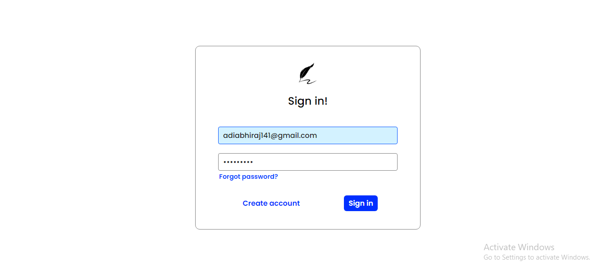

## Feather Docs

Built with React, Typescript, CSS, ExpressJS, MySql, NodeJS, and Socket.IO

### API Documentation

...

## Project Screen Shot(s)

- Full Register/Login/Verify Email functionality, with helpful toast notifications to guide you.

  

- Basic document dashboard to create new documents, and navigate to your recent or shared documents.

  

- Real time collaboration. Work on documents at the same time with those you've shared the document with.

  

## Installation and Setup Instructions

Clone down this repository. You will need node and npm installed globally on your machine.

Client Installation:

`cd client`

Install Dependencies:

`npm install`

To Start Server:

`npm start`

To Visit App:

`localhost:3000`

Server Installation:

`cd server`

Create the .env file in the root directory:

`touch .env`

You will need to add all of the neccessary environment variables.

Install Dependencies:

`npm install`

To Start Server:

`npm start`

To Visit App:

`localhost:3000`

## Reflection

This was a long project I used to learn web sockets, and sharpen my React skills. While the project still has a ton of functionality that could be added, I accomplished my goals of the project. I used Socket.IO to create and consume web sockets, to provide real-time collaboration between your peers. I learned a lot about React particularly on how to structure and consume Contexts and Hooks.